# Module-Cosmos

## Overview

- **Role**: Central CPU module of henad
- **Core Processor**: [diad-cosmos](../../processors/cosmos/cosmos.md)
- **Base Unit**: [unit-kairos](../../units/kairos/kairos.md)
- **Interconnect**: [lygo](../../interfaces/lygo/lygo.md)

## Features

- Main general-purpose CPU
- 24-bit integer, fixed-point, floating-point math
- 48-bit addressing

## Architecture

- [diad-cosmos processor](../../processors/cosmos/cosmos.md)
- SDRAM for program/data memory
- SD card storage

```mermaid
graph LR
   subgraph COSMOS["Cosmos domain"]
     COSMOS-CORE[cosmos-core]
     COSMOS-MMU[cosmos-mmu]
     COSMOS-FABRIC[cosmos-fabric]
     DMA[dma]
   end
   COSMOS-CORE[cosmos-core] <-->|"Load/store bus<br/>virtual addr"| COSMOS-MMU[cosmos-mmu]
   COSMOS-MMU <-->|"Memory bus<br/>physical addr"| COSMOS-FABRIC[cosmos-fabric]
   SDRAM[SDRAM] <-->|"DRAM signals"| SDRAM-CONTROLLER[sdram-controller]
   SDRAM-CONTROLLER <-->|"Fabric<br/>slave port"| COSMOS-FABRIC
   COSMOS-FABRIC <-->|"Fabric<br/>master port"| DMA[dma]
   COSMOS-FABRIC <-->|"Fabric<br/>master port"| ATOMOS-MUX[atomos-mux]
   ATOMOS-MUX <-->|"Control-plane<br/>access"| LYGO-EP[lygo-ep]
   ATOMOS-MUX <-->|"Load/store bus<br/>phys addr"| ATOMOS-CORE[atomos-core]
   LYGO-EP <-->|"Transaction ↔ Link<br/>packet interface"| LYGO-LINK[lygo-link]
   LYGO-LINK <-->|"Framed link protocol<br/>(flits + credits)"| LYGO-PHY[lygo-phy]
```

## Prototype 1 Parameters

- FPGA: ULX3S
- Clock: 50 MHz (proto-1)

## Roadmap

- Expand to 4 cores
- Support SSD storage
- Higher clock speeds
