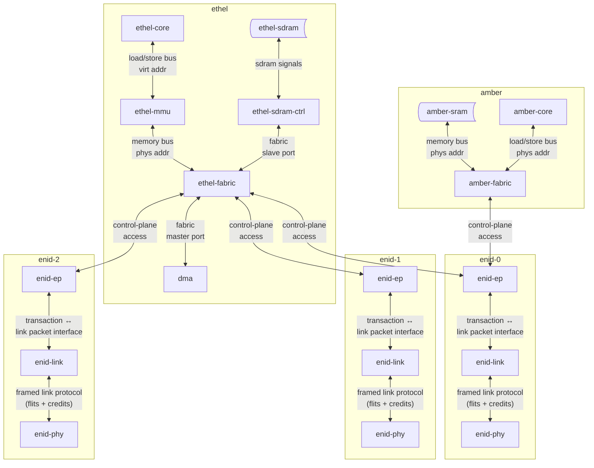

# Module-ethel

## Overview

- **Role**: Central CPU module of henad
- **Core Processor**: [diad-ethel](../../processors/ethel/ethel.md)
- **Base Unit**: [unit-ada](../../units/ada/ada.md)
- **Interconnect**: [enid](../../interfaces/enid/enid.md)

## Features

- Main general-purpose CPU
- 24-bit integer, fixed-point, floating-point math
- 48-bit addressing

## Architecture

- [diad-ethel processor](../../processors/ethel/ethel.md)
- SDRAM for program/data memory
- SD card storage

## Prototype 1 Parameters

- FPGA: ULX3S
- Clock: 50 MHz (proto-1)

## Roadmap

- Expand to 4 cores
- Support SSD storage
- Higher clock speeds
