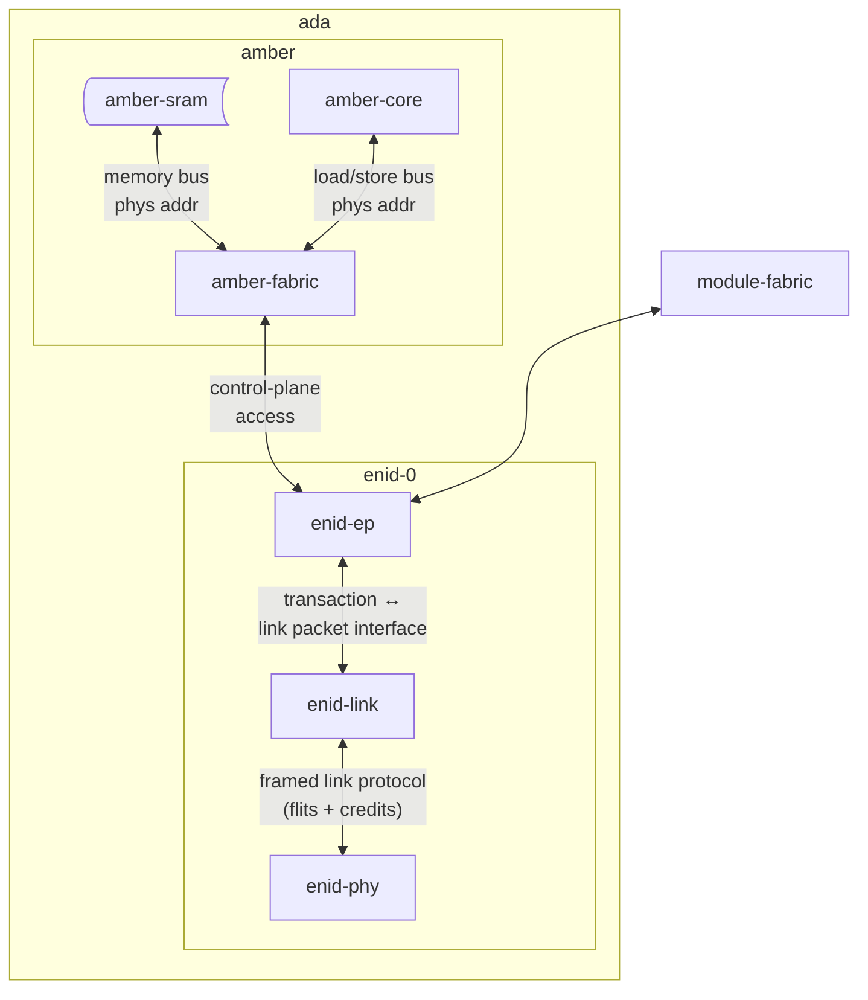

# unit-ada

## Overview

- **Role**: Standard base unit inside every module
- **Core**: [diad-amber](../../processors/amber/amber.md) (embedded 24-bit RISC-like core)
- **Interfaces**: [enid](../../interfaces/enid/enid.md) endpoint
- **Memory**: SDRAM + Flash (firmware)

## Functions

- Provides module-level management & firmware
- Bridges local processor (e.g. ethel, iris) to [enid](../../interfaces/enid/enid.md) fabric
- Executes housekeeping tasks

## Components

- [diad-amber core](../../processors/amber/amber.md)
- [enid](../../interfaces/enid/enid.md) PHY

## Architecture

## Prototype 1 Notes

- Clock: 100 MHz
- Implemented on the Arora-V FPGA of each module
